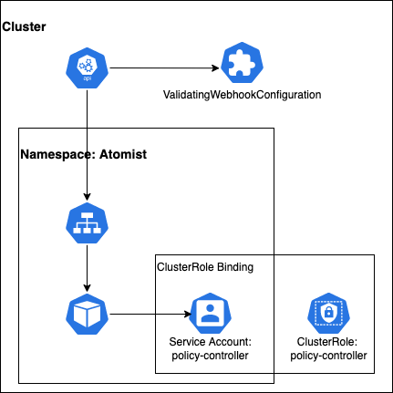

# adm-ctrl

A [ValidatingWebhookConfiguration](https://kubernetes.io/docs/reference/access-authn-authz/admission-controllers/#validatingadmissionwebhook) which allows integration with Atomist for two purposes:

1) To protect clusters from running vulnerable images. The service will validate images deployed to [enabled namespaces (via annotation)](#enable-image-check-policy) by checking whether Atomist has recorded any failed checks for the image being deployed.
1) To track which images are deployed to different clusters.

The underlying deployment will run a Clojure web-service which listens on `/` for `POST`s from the cluster. For pods being created in namespaces where enforcement has been enabled the service will make a query against Atomist's API and will check that, for the image, checks have been run and that there are no failed checks listed. For all pods appearing in the cluster (against any namespace, not just those with enforcement enabled) the service will call back to Atomist and make a note that the image has been seen in the cluster. This allows tracking of images as they move through the deployment process (from staging to production etc.) and allows the building of an inventory of deployed images in each cluster.

## Configuration

Configuration of the service is managed via the following environment variables:

* `ATOMIST_URL` - The webhook URL to use when talking back to Atomist. This can be found via the [Integrations page](https://dso.atomist.com/r/auth/integrations) on the Atomist website.
* `ATOMIST_WORKSPACE` - The ID of your Atomist workspace. This can be found via the [Integrations page](https://dso.atomist.com/r/auth/integrations) on the Atomist website.
* `ATOMIST_APIKEY` - An API key which will be used when talking abck to Atomist. This needs to have sufficient privileges against the workspace above. API keys can be generated via the [Integrations page](https://dso.atomist.com/r/auth/integrations) on the Atomist website.
* `CLUSTER_NAME` - A name which is used to describe the cluster. This name will be used to track which clusters an image has been deployed to as it progresses so a name like `staging` or `production` is a likely value.

There are samples of the various K8s objects which are required for the controller to function in the `resources/k8s` directory. By default the `ValidatingWebhookConfiguration` in the samples has a `failurePolicy` of `Ignore` which is a good starting point but as you become more confident in your adoption you might want to change this to to `Fail`.

## Installation

### Using Flux

To use [Flux](https://fluxcd.io) to install the controller we'll create a `GitRepository` source which points to the GitHub repo containing the various Kubernetes resources that the controller will need and put that somewhere Flux can find it.

```yaml
apiVersion: source.toolkit.fluxcd.io/v1beta1
kind: GitRepository
metadata:
  name: adm-ctrl
  namespace: flux-system
spec:
  interval: 30s
  ref:
    branch: main
  url: https://github.com/atomisthq/adm-ctrl
```

Using that source we can create a `Kustomization` which will allow us to pull in the resources (from the `resources/k8s/controller` directory of the repo) required by the controller. We'll want to customize the `CLUSTER_NAME` environment variable in the controller deployment so we can use kustomize to do that. This file will also be the place where we specify which controller image we are running.

```yaml
apiVersion: kustomize.toolkit.fluxcd.io/v1beta2
kind: Kustomization
metadata:
  name: adm-ctrl
  namespace: flux-system
spec:
  targetNamespace: atomist
  interval: 10m0s
  decryption:
    provider: sops
    secretRef:
      name: sops-gpg
  sourceRef:
    kind: GitRepository
    name: adm-ctrl
  path: ./resources/k8s/controller
  prune: true
  patches:
    - patch: |-
        apiVersion: apps/v1
        kind: Deployment
        metadata:
          name: policy-controller
          namespace: atomist
        spec:
          template:
            spec:
              containers:
                - name: controller
                  env:
                    - name: CLUSTER_NAME
                      value: production
      target:
        kind: Deployment
        name: policy-controller
  images:
  - newTag: v4-5-ga51c3ee
    name: atomist/adm-ctrl
```

For this example we're going to encode the remaining three environment variables listed above (`ATOMIST_URL`, `ATOMIST_WORKSPACE`, `ATOMIST_APIKEY`) into a single secret using [sops](https://fluxcd.io/docs/guides/mozilla-sops/). Once that secret file has been created somewhere in the repo we'll need a `kustomization.yaml` alongside it to let Flux know about it.

```yaml
apiVersion: kustomize.config.k8s.io/v1beta1
kind: Kustomization
resources:
  - secret.yaml
```

We can then create another `Kustomization` file which will pull in all resources in the directory we put the lat file. For this example that happens to be in `./adm-ctrl/production` but it can, of course, be anywhere relevant to the layout of your Flux repo.

```yaml
apiVersion: kustomize.toolkit.fluxcd.io/v1beta2
kind: Kustomization
metadata:
  name: adm-ctrl-resources
  namespace: flux-system
spec:
  interval: 10m0s
  decryption:
    provider: sops
    secretRef:
      name: sops-gpg
  sourceRef:
    kind: GitRepository
    name: flux-system
  path: ./adm-ctrl/production
  prune: true
```

Now you can commit these changes to your Flux repo and have the various controllers pick up the changes and create all the necessary resources.

### Manually

If you'd prefer to have complete control over the resources which are created in your cluster then you can choose to install the various resources in the `resources/k8s` directory of this repo manually. You can use [kustomize](https://kubectl.docs.kubernetes.io/installation/kustomize/) to generate the files to `kubectl apply` if that works for you.

### Fork the repo

#### Prerequisites

1.  [kustomize][kustomize] (tested with `v4.4.1`)
2.  [kubectl][kubectl] (tested with `v1.21.1`)
3.  kubectl must be authenticated and the current context should be set to the cluster that you will be updating

[kustomize]: https://kubectl.docs.kubernetes.io/installation/kustomize/
[kubectl]: https://kubectl.docs.kubernetes.io/installation/kubectl/

###3 1. Fork this repo

[Fork this repo](https://github.com/atomisthq/adm-ctrl/fork).

This repo contains a set of base kubernetes that you'll adapt using `kustomize`.

#### 2. Api Key and Api Endpoint URL

Create an overlay for your cluster.  Choose a cluster name and then create a new overlay directory.

```bash
CLUSTER_NAME=replacethis
mkdir -p resources/k8s/overlays/${CLUSTER_NAME}
```

Create a file named `resources/k8s/overlays/${CLUSTER_NAME}/endpoint.env`.

The file will start out like this.

```properties
apiKey=<replace this>
url=<replace this>
```

The `apiKey` and `url` should be filled in with your workspace's values.  Find these in the [Integrations page](https://dso.atomist.com/r/auth/integrations) of the Atomist app and replace them in the file.

#### 3. Create ssl certs for your Admission Controller

The communication between the api-server and the admission controller will be over HTTPS.  This will be configured by running 3 kubernetes jobs in the cluster.

1.  policy-controller-cert-create job - this job will create SSL certs and store them in a secret named `policy-controller-admission-cert` in the atomist namespace
2.  policy-controller-cert-path job - this will patch the admission controller webhook with the ca cert (so that the api-server will trust the new policy-controller)
3.  keystore-create job - this will read the SSL certs created by the policy-controller-cert-create job and create a keystore for the policy-controller HTTP server.  The keystore is also stored in a secret named `keystore` in the atomist namespace.

You can do steps 1 and 3 now.

```bash
# creates roles and service account for running jobs
kustomize build resources/k8s/certs | kubectl apply -f -
kubectl apply -f resources/k8s/jobs/create.yaml
kubectl apply -f resources/k8s/jobs/keystore_secret.yaml
```

#### 4. Update Kubernetes cluster

This procedure will create a service account, a cluster role binding, two secrets, a service, and a deployment.  All of these will be created in a new namespaced called `atomist`.



Use the same overlay that you created above (`resources/k8s/overlays/${CLUSTER_NAME}`).  Copy in a template kustomization.yaml file.

```bash
cp resources/templates/default_controller.yaml resources/k8s/overlays/${CLUSTER_NAME}/kustomization.yaml
```

This kustomization file will permit you to change the `CLUSTER_NAME` environment variable.
In the initial copy of the file, the value will be `"default"`, but it should be changed to the name of your cluster.  This change is made to the final line in your new kustomization file.

```yaml
resources:
  - ../../controller
secretGenerator:
- name: endpoint
  behavior: merge
  envs:
  - endpoint.env
patchesJson6902:
- target:
    group: apps
    version: v1
    kind: Deployment
    name: policy-controller
  patch: |-
    - op: replace
      path: /spec/template/spec/containers/0/env/2/value
      value: "default"
```

Deploy the admission controller into the the current kubernetes context using the command shown below.

```bash
kustomize build resources/k8s/overlays/sandbox | kubectl apply -f -
```

At this point, the admission controller will be running but the cluster will not be routing any admission control requests to it.  Create a configuration to start sending admission control requests to the controller using the following script.

```bash
# skip the kube-system namespace
kubectl label namespace kube-system policy-controller.atomist.com/webhook=ignore
# validating webhook configuration
kubectl apply -f resources/k8s/admission/admission.yaml
# finally, patch the admission webhook with the ca certificate generated earlier
kubectl apply -f resources/k8s/jobs/patch.yaml
```

## Enable image check policy

```bash
kubectl annotate namespace production policy-controller.atomist.com/policy=enabled
```

Disable policy on a namespace by removing the annotation or setting it to something other than `enabled`.

```bash
kubectl annotate namespace production policy-controller.atomist.com/policy-
```

[dynamic-admission-control]: https://kubernetes.io/docs/reference/access-authn-authz/extensible-admission-controllers/
